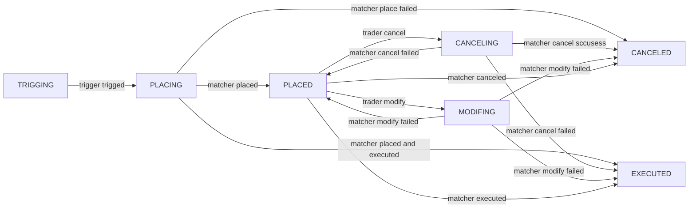

[Wiki Home](https://github.com/XinYang-Pan/Misc/wiki)

```mermaid

graph LR;


          TRIGGING-->|trigger trigged|PLACING;
          PLACING-->|matcher placed|PLACED;
          PLACING-->|matcher placed and executed|EXECUTED;
          PLACING-->|matcher place failed|CANCELED;
          CANCELING-->|matcher cancel failed|PLACED;
          CANCELING-->|matcher cancel failed|EXECUTED;
          CANCELING-->|matcher cancel sccusess|CANCELED;
          MODIFING-->|matcher modify failed|PLACED;
          MODIFING-->|matcher modify failed|EXECUTED;
          MODIFING-->|matcher modify failed|CANCELED;
          PLACED-->|matcher canceled|CANCELED;
          PLACED-->|matcher executed|EXECUTED;
          PLACED-->|trader cancel|CANCELING;
          PLACED-->|trader modify|MODIFING;
```
